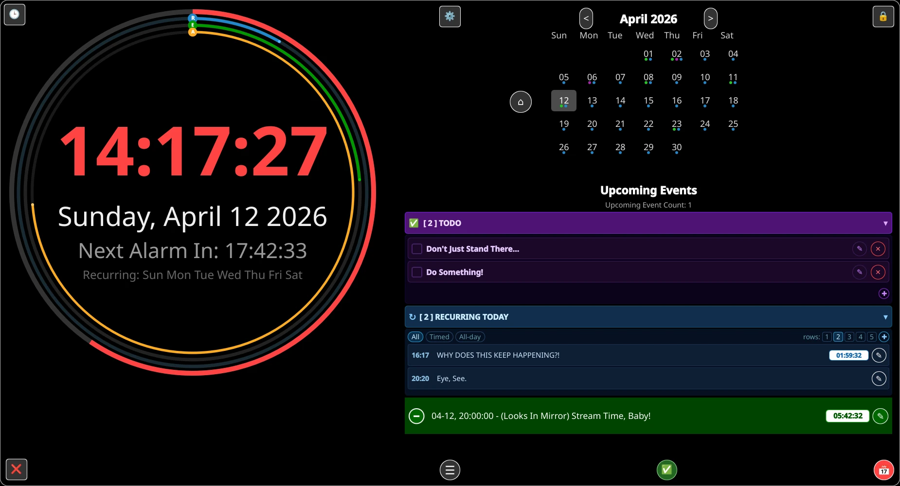

> [!NOTE]  
> Besides regular intervention in its structuring, the vast-majority of this app is "vibe coded". 
> It is not intended for general-use, and fills a very specific usecase for 2 always-on machines.

# TTYM 

A Smart-Clock GUI for my upcycled ultrabook machines, built with [Quickshell](https://quickshell.org/) and [QML](https://doc.qt.io/qt-6/qtqml-index.html).

## Features

- Analog alarm clock with customizable ring
- Monthly calendar with event indicator dots for event type
- Event management (one-time, all-day, recurring)
- Todo list with per-day done tracking
- Upcoming events and todo sidebar
- Settings and brightness controls

## Entry point

`quickshell -p shell.qml`
